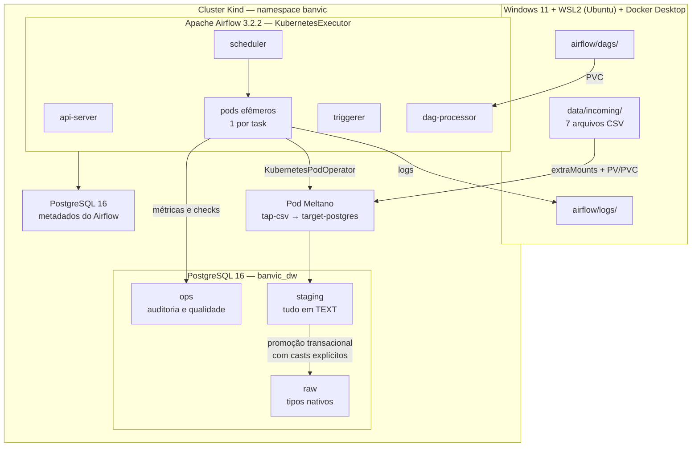
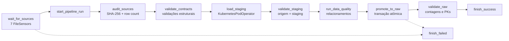

# BanVic Data Platform

Plataforma local, reproduzível e conteinerizada para ingestão das sete tabelas
do ERP do Banco Vitória S.A., disponibilizadas como CSV, em um Data Warehouse
PostgreSQL executado dentro de Kubernetes.

---

## Objetivo

Simular a centralização de um sistema legado on-premise num Data Warehouse,
demonstrando ingestão orquestrada, qualidade de dados, idempotência,
auditoria e tratamento de falhas — com toda a infraestrutura declarada em
código e reconstruível do zero.

O critério não é "os containers subiram". É poder demonstrar, com evidência
executável, que:

- os sete arquivos chegam ao destino sem um byte alterado;
- executar duas vezes não duplica registro;
- uma carga defeituosa não destrói a versão válida dos dados;
- os problemas da origem são registrados, não corrigidos silenciosamente.

---

## Arquitetura



### Fluxo do pipeline



Documentação detalhada em [`docs/architecture.md`](docs/architecture.md).

---

## Stack

Todas as versões são fixadas em [`versions.env`](versions.env). Nenhuma tag
flutuante, nenhum `latest`.

| Componente | Versão | Papel |
|---|---|---|
| Kind | `v0.32.0` | Cluster Kubernetes local |
| Node image | `kindest/node:v1.34.8` (por digest) | Nó do cluster |
| Terraform | `>= 1.9` | Provisiona namespace, volumes e PostgreSQL |
| Helm | `>= 3.19` | Instala o Airflow |
| Chart Airflow | `1.22.0` | Manifesto do Airflow |
| Apache Airflow | `3.2.2` | Orquestração, KubernetesExecutor |
| Meltano | `4.2.2` | Extract + Load |
| tap-csv | `v1.3.2` (tag Git) | Leitura dos CSVs |
| target-postgres | `0.8.0` | Escrita no PostgreSQL |
| PostgreSQL | `16` (por digest) | Data Warehouse e metadados |
| Python | `3.12` | Contratos, auditoria, validação |

### Por que estas escolhas

**Kind** em vez de Minikube ou k3d: é o padrão recomendado pelo próprio
projeto Kubernetes para testes, cria o cluster a partir de containers Docker
e permite fixar o nó por digest imutável. Reconstruir o ambiente do zero leva
minutos.

**Terraform** em vez de `kubectl apply`: o estado desejado fica declarado, e
rodar duas vezes não altera nada. O módulo `modules/postgres` é instanciado
duas vezes com configurações diferentes, evitando duplicação de código.

**Airflow com KubernetesExecutor** em vez de Celery: sem broker, sem Redis,
sem workers ociosos. Cada task vira um pod que nasce, executa e morre, o que
também isola falhas.

**Meltano** para o Extract + Load, com Python apenas para auditoria,
validação e testes. A movimentação `CSV → staging` é feita pelo protocolo
Singer, não por pandas.

**PostgreSQL** em vez de MinIO como destino: as fontes são relacionais, são
sete tabelas, a consulta final é SQL, e a verificação de row counts e
integridade fica trivial. Ver [ADR 0001](docs/adr/0001-postgresql-como-destino.md).

**KubernetesPodOperator** para o Meltano: ele roda em imagem própria, com
ciclo de vida e dependências independentes do Airflow.

---

## Pré-requisitos

- Windows 11 com WSL2 e uma distribuição Ubuntu
- Docker Desktop com integração WSL habilitada
- **10 GB de memória** alocados ao WSL2 (8 GB é o mínimo funcional)
- O projeto clonado em `ext4` (`~/projetos/`), **nunca** em `/mnt/c/`

Ferramentas dentro da Ubuntu: `docker`, `kubectl`, `kind`, `helm`,
`terraform`, `make`, `python3`, `git`.

Valide tudo com:

```bash
make check
```

Ele confere versões, memória do Docker, tipo do filesystem e presença dos
sete arquivos de origem.

### Por que ext4 importa

Os `extraMounts` do Kind fazem bind mount do host para dentro do container do
nó. Sobre `9p`/`drvfs` (o `/mnt/c` do WSL2) o bit de execução não persiste,
finais de linha CRLF quebram shebangs, e o volume pode chegar vazio ao pod sem
erro nenhum. O `make check` barra essa configuração.

---

## Estrutura do projeto

```
banvic-data-platform/
├── airflow/
│   ├── dags/banvic_ingestion.py      DAG de ingestão
│   ├── include/contracts/            contratos declarativos (YAML)
│   └── logs/                         logs das tasks (não versionado)
├── data/incoming/                    os 7 CSVs (não versionados — LGPD)
├── docs/                             documentação e ADRs
├── images/
│   ├── airflow/Dockerfile            imagem própria com o pacote banvic
│   └── meltano/Dockerfile            imagem própria com tap e target
├── infra/
│   ├── kind/cluster.yaml             definição do cluster
│   ├── helm/airflow-values.yaml      configuração do Airflow
│   └── terraform/                    namespace, volumes, PostgreSQL
├── meltano/
│   ├── meltano.yml                   7 streams, tap-csv e target-postgres
│   └── k8s/                          Job standalone para depuração
├── scripts/                          verify, rebuild, secrets, testes
├── sql/
│   ├── ddl/                          DDL idempotente de ops e raw
│   ├── promotion/promote_raw.sql     promoção com casts explícitos
│   └── quality/                      consultas de evidência
├── src/banvic/                       contratos, auditoria, validação, ops
├── tests/
│   ├── unit/                         46 testes, sem dependência externa
│   └── integration/                  20 testes contra o banco real
├── Makefile
├── versions.env                      versões fixadas
└── versions.lock                     digests imutáveis das imagens
```

---

## Configuração

```bash
cp .env.example .env
```

Gere senhas de verdade:

```bash
gen() { openssl rand -base64 32 | tr -dc 'A-Za-z0-9' | head -c 28; }
sed -i "s|^BANVIC_DW_PASSWORD=.*|BANVIC_DW_PASSWORD=$(gen)|" .env
sed -i "s|^AIRFLOW_METADATA_PASSWORD=.*|AIRFLOW_METADATA_PASSWORD=$(gen)|" .env
sed -i "s|^AIRFLOW_ADMIN_PASSWORD=.*|AIRFLOW_ADMIN_PASSWORD=$(gen)|" .env
chmod 600 .env
```

O `.env` está no `.gitignore` e **nunca** deve ser commitado.

Ambiente Python local (Ubuntu 24.04 exige venv por causa do PEP 668):

```bash
make setup-dev
```

---

## Como disponibilizar os CSVs

Os arquivos **não são versionados**: contêm CPF, CNPJ, nomes e endereços de
998 clientes e 100 colaboradores. Coloque-os manualmente:

```bash
cp /caminho/dos/arquivos/*.csv data/incoming/
ls -1 data/incoming/*.csv | wc -l   # deve retornar 7
```

Esperado em `data/incoming/`:

```
agencias.csv  clientes.csv  colaborador_agencia.csv  colaboradores.csv
contas.csv    propostas_credito.csv                  transacoes.csv
```

---

## Deploy

```bash
make lock-images     # resolve digests imutáveis das imagens
```

```bash
set -a; source versions.lock; set +a
export TF_VAR_pg_image="$PG_IMAGE_DIGEST"
make rebuild
```

O `make rebuild` executa, em sequência: destrói o cluster anterior, cria o
Kind a partir do `cluster.yaml`, **aborta se os sete CSVs não chegarem ao
nó**, aplica o Terraform, cria os Secrets, instala o Airflow via Helm,
constrói e injeta as imagens próprias, e valida o resultado.

Leva de 8 a 12 minutos na primeira vez.

```bash
make ddl        # cria os schemas ops e raw (idempotente)
make verify     # confirma que a plataforma está operacional
```

---

## Como executar a DAG

Pela interface, em `http://localhost:8080`: ative `banvic_ingestion` e
dispare.

Pelo terminal:

```bash
SC=$(kubectl get pod -n banvic -l component=scheduler -o jsonpath='{.items[0].metadata.name}')
kubectl exec -n banvic "$SC" -c scheduler -- airflow dags unpause banvic_ingestion
kubectl exec -n banvic "$SC" -c scheduler -- airflow dags trigger banvic_ingestion
```

Acompanhe os pods efêmeros nascendo e morrendo:

```bash
kubectl get pods -n banvic -w
```

A execução completa leva cerca de 2 minutos.

---

## Como acessar o Airflow

```
http://localhost:8080
```

O Service do `api-server` é NodePort 30080, mapeado para a porta 8080 do host
pelo `extraPortMappings` do Kind. Não precisa de `port-forward`.

Credenciais:

```bash
grep AIRFLOW_ADMIN .env
```

---

## Como acessar o PostgreSQL

**De dentro do cluster:**

```bash
make dw-psql
```

**Do host** (DBeaver, psql, qualquer cliente):

```
host: localhost   porta: 15432
```

```bash
set -a; source .env; set +a
PGPASSWORD="$BANVIC_DW_PASSWORD" psql -h localhost -p 15432 \
  -U "$BANVIC_DW_USER" -d "$BANVIC_DW_DB"
```

---

## Como verificar as tabelas

```bash
make staging-counts
make raw-counts
```

Resultado esperado em `raw`, com `linhas` igual a `pks_distintas`:

| tabela | registros |
|---|---:|
| agencias | 10 |
| clientes | 998 |
| colaborador_agencia | 100 |
| colaboradores | 100 |
| contas | 999 |
| propostas_credito | 2.000 |
| transacoes | 71.999 |

Auditoria da última execução:

```bash
kubectl exec -i banvic-postgres-0 -n banvic -- \
  sh -c 'psql -U "$POSTGRES_USER" -d "$POSTGRES_DB" -f -' <<'SQL'
SELECT table_name, row_count_source, row_count_staging, row_count_raw,
       left(source_checksum, 16) AS checksum
  FROM ops.pipeline_table_metrics
 WHERE run_id = (SELECT run_id FROM ops.pipeline_runs
                  WHERE status = 'SUCCESS' ORDER BY started_at DESC LIMIT 1)
 ORDER BY table_name;
SQL
```

---

## Data Quality

O projeto separa dois conceitos que costumam ser confundidos.

**Validação estrutural** indica possível falha técnica e pode impedir a
promoção: arquivo ausente ou vazio, cabeçalho incompatível, PK nula, PK
duplicada, contagem divergente entre origem e staging.

**Qualidade dos dados de negócio** é registrada e preservada, nunca
corrigida.

A severidade vem dos contratos declarativos, não do código. Um `CheckResult`
só bloqueia a promoção quando tem `status = FAIL` **e**
`severity = CRITICAL`.

### O caso do cliente 528

A origem tem uma inconsistência real: `clientes.csv` traz 998 registros com
códigos de 1 a 999, e o `cod_cliente = 528` não existe. Mas `contas.csv` tem
1 registro e `propostas_credito.csv` tem 4 registros apontando para ele.

O pipeline **não** inventa o cliente, não exclui os registros órfãos e não
altera as chaves. Ele preserva tudo e registra o problema:

```bash
kubectl exec -i banvic-postgres-0 -n banvic -- \
  sh -c 'psql -U "$POSTGRES_USER" -d "$POSTGRES_DB" -f -' <<'SQL'
SELECT table_name, check_name, severity, status, invalid_rows
  FROM ops.data_quality_results
 WHERE run_id = (SELECT run_id FROM ops.pipeline_runs
                  WHERE status = 'SUCCESS' ORDER BY started_at DESC LIMIT 1)
   AND status <> 'PASS';
SQL
```

Resultado: `fk_contas_clientes` com `WARN` e 1 linha, e
`fk_propostas_credito_clientes` com `WARN` e 4 linhas. O pipeline termina com
sucesso.

É por isso que a camada `raw` **não tem foreign keys**: elas rejeitariam
esses cinco registros e o pipeline estaria corrigindo a origem em silêncio.

Detalhes em [`docs/data-quality.md`](docs/data-quality.md).

---

## Idempotência

Os CSVs são snapshots das tabelas do ERP, não incrementos. A carga é
full-refresh controlada:

```
CSV → staging (load_method: overwrite)
        ↓ validações estruturais
      BEGIN
        TRUNCATE raw.<tabela>
        INSERT INTO raw SELECT <casts explícitos> FROM staging
      COMMIT
```

Teste explícito:

```bash
make test-idempotency
```

Ele executa a carga duas vezes e compara as contagens. Saída esperada:

```
IDEMPOTENCIA: OK -- contagens identicas nas duas execucoes.
```

---

## Tratamento de falhas

A promoção acontece dentro de **uma transação**. Se qualquer cast falhar, o
`ROLLBACK` devolve inclusive os `TRUNCATE`, e a versão anterior de `raw`
permanece intacta.

Demonstração automatizada em dois cenários reversíveis:

```bash
make test-failure
```

**Cenário A** move um arquivo de origem e mostra a validação estrutural
bloqueando antes de qualquer escrita no banco.

**Cenário B** injeta um valor inválido em `staging`, executa a promoção,
mostra o aborto no cast, e compara as contagens de `raw` antes e depois.

Ambos restauram o estado original, inclusive no caminho de erro.

Resiliência na DAG: `retries` com `retry_delay`, `execution_timeout`,
`FileSensor` em modo `reschedule` para não ocupar worker, e as tasks
`finish_success` / `finish_failed` com `trigger_rule` distintos, garantindo
que `ops.pipeline_runs` seja sempre fechado.

---

## Segurança

Nenhuma credencial no repositório. Verificável:

```bash
set -a; source .env; set +a
git grep -I "$BANVIC_DW_PASSWORD" -- . && echo "VAZAMENTO" || echo "OK"
grep -c "$BANVIC_DW_PASSWORD" infra/terraform/terraform.tfstate 2>/dev/null || echo "OK"
```

Decisões:

- Os Secrets do Kubernetes são criados por `scripts/create_secrets.sh`, **não
  pelo Terraform**. Valores gerenciados por Terraform ficam em texto plano no
  `terraform.tfstate`. Ver [ADR 0003](docs/adr/0003-secrets-fora-do-terraform.md).
- `.env`, `terraform.tfstate` e os CSVs estão no `.gitignore`.
- As imagens rodam como usuário não-root (uid 50000 no Airflow, uid 1000 no
  Meltano).
- O contexto de build é restrito por `.dockerignore`: nenhum CSV entra nas
  imagens.
- A senha do admin do Airflow é passada por `--set` a partir do `.env`, nunca
  do `values.yaml` versionado.

### Sobre dados pessoais

As fontes contêm CPF, CNPJ, nomes, e-mails, datas de nascimento e endereços.
Por isso `data/incoming/*.csv` está no `.gitignore` e nenhum dado real
aparece nesta documentação. Os arquivos precisam ser disponibilizados
manualmente por quem executar o projeto.

---

## Testes

```bash
make lint              # ruff em src, scripts, tests e dags
make test              # 46 testes unitários, sem dependência externa
make test-integration  # 20 testes contra o banco real
make test-idempotency  # duas execuções, contagens comparadas
make test-failure      # dois cenários de falha controlada
make test-all          # tudo acima, em sequência
```

Os testes unitários cobrem checksum, contratos, validação de schema, PK nula,
PK duplicada, arquivo vazio, arquivo ausente, row count e montagem de SQL
contra injeção.

Os de integração verificam o que só se sabe depois da execução: os tipos que
os casts produziram, os zeros à esquerda preservados em CPF e CEP, a precisão
decimal não arredondada, o cliente 528 como órfão, e — o mais importante —
que os checksums gravados em `ops` batem com o SHA-256 dos arquivos em disco.

---

## Troubleshooting

Os problemas mais comuns, com sintoma, causa e solução, estão em
[`docs/troubleshooting.md`](docs/troubleshooting.md). Os três que mais
aparecem:

**Após reiniciar a máquina, o tap-csv não acha os arquivos.** Os
`extraMounts` do Kind não se restabelecem com `docker start`. Rode
`make verify`; se acusar a ponte quebrada, `make rebuild`.

**`dag-processor` em CrashLoopBackOff com `FileNotFoundError` num arquivo de
log.** O volume de logs precisa pertencer ao uid 50000.

**Pods em `Pending` indefinido.** Verifique memória do Docker Desktop e o
status dos PVCs com `kubectl get pvc -n banvic`.

---

## Como destruir o ambiente

```bash
make destroy
```

Remove o cluster Kind por completo. Os CSVs em `data/incoming/` e o `.env`
permanecem intactos no host.

Para reconstruir do zero:

```bash
set -a; source versions.lock; set +a
export TF_VAR_pg_image="$PG_IMAGE_DIGEST"
make rebuild
```

---

## Documentação adicional

| Documento | Conteúdo |
|---|---|
| [architecture.md](docs/architecture.md) | Desenho detalhado, fluxo de dados, camadas |
| [data-dictionary.md](docs/data-dictionary.md) | As sete tabelas e as particularidades da origem |
| [data-quality.md](docs/data-quality.md) | Política de severidade e catálogo de verificações |
| [runbook.md](docs/runbook.md) | Operação do dia a dia |
| [troubleshooting.md](docs/troubleshooting.md) | Problemas conhecidos e soluções |
| [evidence-checklist.md](docs/evidence-checklist.md) | Comandos de comprovação |
| [adr/](docs/adr/) | Registros de decisão arquitetural |
